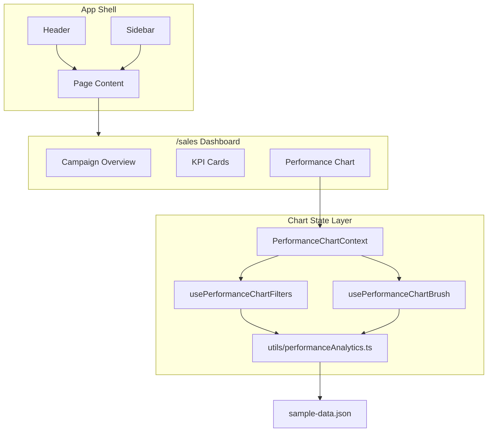

<div align="center">

# Deal Dashboard

**A responsive advertising deal dashboard with campaign analytics, KPI cards, and interactive performance charts.**

<br />


<br />

[Getting Started](#getting-started) ·
[Features](#features) ·
[Project Structure](#project-structure) ·
[Scripts](#available-scripts)

</div>

---

## Overview

Deal Dashboard is a desktop-first web application for monitoring advertising deals end-to-end. It combines a **campaign summary view** with rich **performance analytics** — KPI cards, budget gauges, delivery rings, and a combo bar/line chart with filters, zoom, and CSV export.

The app uses **mock JSON data** (`sample-data.json`) so it runs fully offline with no backend or API keys required.

<br />

## Features

<table>
<tr>
<td width="50%" valign="top">

### Deal Dashboard
- Global header with notifications & profile
- Collapsible sidebar navigation (CSS animated)
- Campaign header — status, date range, actions
- Deal metadata row (ID, advertiser, agency, budgets, DSP)
- **Impressions** card with trend indicators
- **Performance** mini-metrics (Big Scroller, Sunrise, Avg CTR, Avg Time Spent, Avg VCR)
- **Campaign Delivery** progress ring with delivered/contracted legend
- **IO Budget** & **Deal Budget** gauge widgets with expandable pacing metrics
- Flight filters on budget cards

</td>
<td width="50%" valign="top">

### Performance Analytics
- Combo **bar + line chart** (Recharts)
- Multi-metric selector (Big Happy & Third Party data)
- Time range dropdown
- Filter dropdowns — Packages, Placements, Targeting, Creative, Product
- Zoom in / out with brush range control
- Live metric summary chips
- **CSV export** of visible chart data
- Collapsible chart section

</td>
</tr>
</table>

<br />

## Tech Stack

| Layer | Technology |
|-------|------------|
| **Framework** | [Next.js 16](https://nextjs.org) (App Router) |
| **UI** | [React 19](https://react.dev) + [Tailwind CSS 4](https://tailwindcss.com) |
| **Styling** | [tailwind-variants](https://www.tailwind-variants.org) for component slots |
| **Charts** | [Recharts 3](https://recharts.org) |
| **Animations** | CSS transitions & keyframes only (no animation library) |
| **Icons** | [Lucide React](https://lucide.dev) |
| **Language** | TypeScript (strict mode, no `any`) |
| **Data** | Static JSON + typed mock modules |

<br />

## Getting Started

### Prerequisites

| Requirement | Version |
|-------------|---------|
| **Node.js** | `18.18+` or `20+` (tested on `22.x`) |
| **npm** | `9+` (comes with Node) |

> No environment variables, database, or external services are required.

<br />

### Installation

```bash
# 1. Extract / clone the project, then enter the folder
cd dashboard

# 2. Install dependencies
npm install
```

<br />

### Run Locally

```bash
# Development server (with hot reload)
npm run dev
```

Open **[http://localhost:3000](http://localhost:3000)** — you'll be redirected to `/sales`.

<br />

### Production Build

```bash
# Create an optimized production build
npm run build

# Start the production server
npm start
```

<br />

## Available Scripts

| Command | Description |
|---------|-------------|
| `npm run dev` | Start development server on port `3000` |
| `npm run build` | Generate optimized production build |
| `npm start` | Serve the production build |
| `npm run lint` | Run ESLint across the project |

<br />

## Project Structure

```
dashboard/
├── public/assets/          # Static images & SVGs (logo, icons)
├── sample-data.json        # Campaign performance dataset
├── src/
│   ├── app/                # Next.js App Router pages & layout
│   │   ├── [section]/      # Dynamic routes (sales, strategy, …)
│   │   ├── globals.css     # Design tokens & global styles
│   │   └── layout.tsx
│   ├── components/ui/      # Reusable UI primitives
│   │   ├── AnalyticsWrapper # Scrollable dashboard content area
│   │   ├── FilterDropdown  # Multi-select filter chips
│   │   ├── GaugeMeter      # Budget gauge widget
│   │   ├── RingMeter       # Delivery donut ring
│   │   ├── Sidebar         # Collapsible navigation (CSS)
│   │   ├── Skeleton        # Shimmer loading placeholders
│   │   └── …
│   ├── hooks/              # Chart state, filters, brush/zoom, sidebar
│   ├── screens/sales/      # Sales dashboard feature modules
│   │   ├── campaign-overview/
│   │   ├── kpi-cards/
│   │   └── performance-analytics/
│   ├── utils/              # Analytics helpers, chart formatters & export
│   │   ├── performanceAnalytics.ts  # Data transforms & chart queries
│   │   └── performanceChart/        # Formatters, constants, CSV export
│   └── __mock__/           # Typed mock data for UI sections
└── package.json
```

<br />

## Architecture



<br />

## Routes

| Route | Status | Description |
|-------|--------|-------------|
| `/` | Redirect | Sends users to `/sales` |
| `/sales` | **Live** | Full deal dashboard |
| `/strategy` | Coming soon | Placeholder page |
| `/am` | Coming soon | Placeholder page |
| `/pas` | Coming soon | Placeholder page |
| `/creative-gallery` | Coming soon | Placeholder page |
| `/park-ranger` | Coming soon | Placeholder page |
| `/benchmarks` | Coming soon | Placeholder page |
| `/sync` | Coming soon | Placeholder page |
| `/user-admin` | Coming soon | Placeholder page |
| `/activity-logs` | Coming soon | Placeholder page |

<br />

## Key Interactions

<details>
<summary><strong>Performance chart filters</strong></summary>

<br />

- Filter dropdowns support multi-select with checkbox menus
- `ListFilter` icon when empty → switches to `✕` when selections are active
- **Clear All** appears when any filter is applied
- Switching to Third Party metrics swaps filter set (DSP, Deal)

</details>

<details>
<summary><strong>Chart zoom & brush</strong></summary>

<br />

- **Zoom In** narrows the visible date range (min 4 data points)
- **Zoom Out** expands back toward the full range
- Drag the brush slider at the bottom to pan/zoom manually
- Buttons auto-disable at min/max zoom limits

</details>

<details>
<summary><strong>Export</strong></summary>

<br />

- Click **Export** in the Performance Analytics header
- Downloads a CSV of the currently visible chart data and selected metrics

</details>

<details>
<summary><strong>Sidebar</strong></summary>

<br />

- Click the toggle to collapse/expand (`250px` ↔ `60px`)
- Animated with **CSS transitions** — width, chevron rotation, and label opacity
- Uses `will-change` during the transition for smoother rendering
- No external animation libraries — CSS transitions and keyframes only
- Active section is highlighted; only **Sales** is fully implemented

</details>

<details>
<summary><strong>Budget card metrics</strong></summary>

<br />

- **IO Budget** and **Deal Budget** cards show average and projected pacing below the gauge
- Click **See More** to expand additional spend, delivery, and pacing breakdown rows
- Click **See Less** to collapse back to the summary view
- **Flights** filter dropdown on each budget card (multi-select)

</details>

<details>
<summary><strong>Chart hover tooltip</strong></summary>

<br />

- Hover chart bars/lines to see a Recharts tooltip with formatted metric values
- Tooltip content is driven by `ChartTooltip` and `formatTooltipValue` helpers

</details>

<br />

## Design System

CSS custom properties in `globals.css` power the palette:

| Token | Value | Usage |
|-------|-------|-------|
| `--primary` | `#1f316d` | Text, charts, accents |
| `--background` | `#e8f1fb` | Page background |
| `--background-secondary` | `#ffffff` | Cards & panels |
| `--link` | `#0059ff` | Links & interactive highlights |
| `--metric-blue` | `#e8f4fd` | Chart & metric chips |

Typography scales responsively with viewport-based `vw` units (`text20`, `text12`, `text10`, `text8`).

<br />

## Data

All analytics are driven from `sample-data.json` at the project root. The `src/utils/performanceAnalytics.ts` module:

- Aggregates daily metrics into chart points
- Computes CTR and axis domains
- Builds filter option lists from package/placement data
- Applies time-range and multi-filter slicing

To swap in real API data, replace the data-fetching logic in `src/utils/performanceAnalytics.ts` while keeping the existing TypeScript interfaces.

<br />

## Accessibility

- Keyboard-navigable dropdowns and filter menus
- `aria-label`, `aria-expanded`, and `role` attributes on interactive controls
- Visible `focus-visible` rings on buttons and inputs
- Loading screen uses a dashboard-shaped skeleton with shimmer animation (`skeleton-shimmer` in `globals.css`)

<br />

## Troubleshooting

<details>
<summary><strong>Port 3000 already in use</strong></summary>

<br />

```bash
# Run on a different port
npx next dev -p 3001
```

</details>

<details>
<summary><strong>Build errors after pulling changes</strong></summary>

<br />

```bash
rm -rf .next node_modules
npm install
npm run build
```

</details>

<details>
<summary><strong>Blank chart or no data</strong></summary>

<br />

Ensure `sample-data.json` exists at the project root. Filters that are too restrictive will show the chart empty state: *"No data available for the selected filters."*

</details>

<br />

---

<div align="center">

**Built with Next.js · React · TypeScript · Tailwind CSS · Recharts**

</div>
